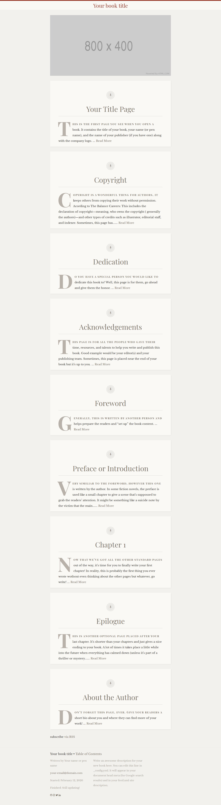

> **This theme is undergoing a major rewrite! I am converting to TailwindCSS and adding style theme support!**

# Libretto Book - Jekyll Theme for Authors

Libretto Book is an updated version of the [Libretto theme by ferrolho](https://github.com/ferrolho/jekyll-theme-libretto) and fully compatible with Github Pages.
I've changed the design a bit to make this theme more suitable for books, i.e. reverse the posts list, added author, etc.

## Preview

[See it in action!](https://bravishkaskytano.github.io/jekyll-theme-libretto-book)

## Usage

To start, you can either click the [Use This Template button](https://github.com/BravishkaSkytano/jekyll-theme-libretto-book/generate) in the top right corner of the repo or use the [jekyll-remote-theme plugin](https://github.com/benbalter/jekyll-remote-theme) and add `remote_theme: BravishkaSkytano/jekyll-theme-libretto-book` to your Jekyll `config.yml` file

After that, all you need to do is edit the `_config.yml` file and replace the chapters in the `_chapters` collection with your own. The config file has a lot of comments to guide you, so it should be easy. If you run into any problems, create an issue or reach out to me through [my socials.](https://bravishkaskytano.github.io/)

**Note:** You may delete the images in the assets folder, they're just for the demo website.

For the file naming of your chapters, make sure they're numbered in the order you want them to be in. I find it easier to have your metadata pages start with "0.#" (0.1, 0.2, 0.3, etc.) and your chapters start with numbers, but it's up to you.
